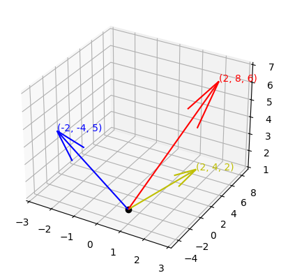
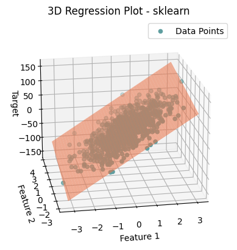
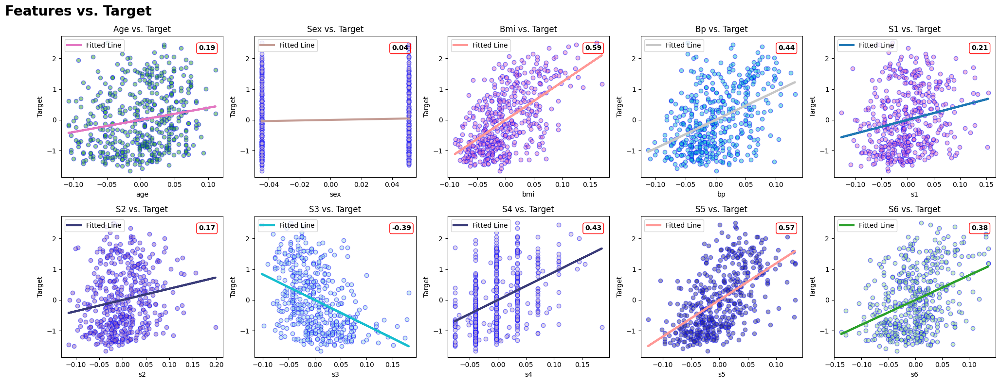

# Linear Algebra in Python

This repository provides a comprehensive resource for learning and implementing linear algebra concepts using Python. It contains Jupyter notebooks, Python scripts, and visualizations to help you understand and apply linear algebra in various fields such as machine learning, computer graphics, physics, and engineering.

## Overview

Linear algebra is a fundamental mathematical discipline with wide-ranging applications. This project aims to bridge the gap between theoretical understanding and practical implementation, offering both explanations and code examples.

## Contents

1. `.gitignore`: Git ignore file for Python projects
2. `LICENSE`: License file detailing the terms of use for this project
3. `decompositions.ipynb`: Exploration of matrix decompositions
4. `diabetes_dataset.ipynb`: Analysis of a real-world diabetes dataset using linear algebra techniques
5. `linear_equations.ipynb`: Study of linear equations, operations, and special matrices
6. `linear_regression.ipynb`: Implementation and analysis of linear regression
7. `matrices_vectors_tensors.ipynb`: Deep dive into matrices, vectors, and tensors (includes JAX)
8. `matrix_vector_tensor_ops.ipynb`: Operations on matrices, vectors, and tensors
9. `plane_equation.png`: Visualization of a plane equation in 3D space
10. `special_matrices.ipynb`: Exploration of special types of matrices and their properties
11. `visualization.ipynb`: Techniques for visualizing linear algebra concepts

## Topics Covered

- Scalars, Vectors, Matrices, and Tensors
- Vector and Matrix Operations
- Systems of Linear Equations
- Eigenvalues and Eigenvectors
- Matrix Decompositions:
  - Singular Value Decomposition (SVD)
  - QR Decomposition
  - Lower–Upper (LU) Decomposition
- Principal Component Analysis (PCA)
- Linear Regression
- Visualization Techniques (2D and 3D)
- Real-world Application: Diabetes Dataset Analysis

## Libraries Used

- NumPy: For efficient numerical computations
- SciPy: For scientific and technical computing
- SymPy: For symbolic mathematics
- JAX: For high-performance machine learning research
- Matplotlib: For creating static, animated, and interactive visualizations
- Pytorch: For tensor operations and deep learning
- Tensorflow: For tensor operations and deep learning

## Getting Started

1. Clone this repository:
   ```
   git clone https://github.com/danieltar18/linear-algebra.git
   ```
2. Install the required dependencies:
   ```
   pip install numpy scipy sympy jax matplotlib pytorch tensorflow jupyter
   ```
3. Launch Jupyter Notebook:
   ```
   jupyter notebook
   ```
4. Navigate to the desired notebook and start exploring!

## Visualization Example

Here are examples my visualizations from this project:
# Vectors in 3D space and Regression in 3D space

<table align="center">
  <tr>
    <td></td>
    <td></td>
  </tr>
</table>

# Real-world Diabetes Dataset



## Contributing

Contributions to improve the notebooks, add new topics, or fix errors are welcome! Please feel free to submit a pull request or open an issue to discuss potential changes.

## License

This project is licensed under the terms specified in the `LICENSE` file. Please review it before using or contributing to this repository.
